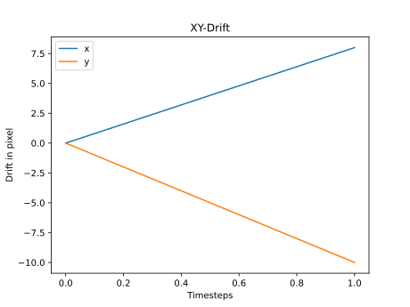
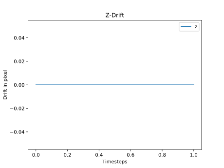
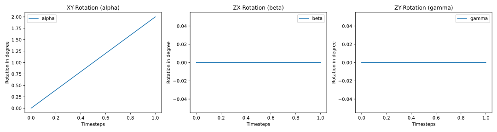

# napari-fast4dreg

[](https://github.com/Macl-I/napari-fast4dreg/raw/main/LICENSE)
[](https://pypi.org/project/napari-fast4dreg)
[](https://python.org)
[](https://github.com/Macl-I/napari-fast4dreg/actions)
[](https://codecov.io/gh/Macl-I/napari-fast4dreg)
[](https://napari-hub.org/plugins/napari-fast4dreg)

Dask-empowered multi-dimensional registration for volumetric measurements with enhanced features and real-time progress tracking.

This is a Python port of the original Fast4DReg Fiji Plugin, with added rotation correction, support for out-of-memory processing, and advanced registration options.

**Original paper:** [Fast4DReg: fast registration of 4D microscopy](https://journals.biologists.com/jcs/article/136/4/jcs260728/287682/Fast4DReg-fast-registration-of-4D-microscopy)

----------------------------------

## ✨ Features

- **Multi-dimensional registration**: XY, Z, and 3D rotation correction
- **Out-of-memory processing**: Handle large datasets that don't fit in RAM using Zarr-based storage
- **Efficient multi-channel handling**: Zarr storage with optimized chunking (1×1×Z×Y×X) for fast per-channel access
- **Flexible projection methods**: Average, Max, Median, or Min projection
- **Reference modes**: Relative (frame-to-frame) or First Frame correction
- **Multi-channel support**: Use multiple reference channels with optional normalization
- **Real-time progress tracking**: Detailed progress updates with ETA and completion time
- **Thread-based execution**: Non-blocking UI during processing
- **Flexible axis ordering**: Support for ImageJ and Python axis conventions
- **Auto-detection**: Automatic single-channel mode detection
- **2D+t support**: Process time-lapse images with various dimensionalities
- **Compressed storage**: Built-in Blosc compression reduces temporary storage by 2-3×

## Installation

### Quick Install (with pip)

You can install `napari-fast4dreg` via [pip]:

```bash
pip install napari-fast4dreg
```

### Recommended: Using Conda/Mamba

For the best experience and easier dependency management, we recommend using [Anaconda](https://www.anaconda.com/download) or [Miniforge/Mambaforge](https://github.com/conda-forge/miniforge):

1. **Install Conda/Mamba** (if not already installed):
   - Download and install [Miniforge](https://github.com/conda-forge/miniforge) (recommended, includes mamba)
   - Or download [Anaconda](https://www.anaconda.com/download) / [Miniconda](https://docs.conda.io/en/latest/miniconda.html)

2. **Create a new environment**:
   ```bash
   conda create -n napari-env python=3.10
   conda activate napari-env
   ```
   
   Or with mamba (faster):
   ```bash
   mamba create -n napari-env python=3.10
   mamba activate napari-env
   ```

3. **Install napari and the plugin**:
   ```bash
   pip install napari[all] napari-fast4dreg
   ```

4. **Launch napari**:
   ```bash
   napari
   ```

### From Source (for development)

```bash
git clone https://github.com/COSC-Lab/napari-fast4dreg.git
cd napari-fast4dreg
pip install -e .
```

## Usage 

### Quick Start

1. **Load your image**: Drag and drop your image (or use the test image from this repository) into napari. Don't worry about file size—napari uses dask internally to handle even the largest images.

2. **Open the plugin**: Navigate to `Plugins → napari-fast4dreg → Fast4DReg` in the napari menu.

3. **Configure settings**:

   - **Image Layer**: Select your image from the dropdown menu
   
   - **Axis Order**: Choose your data structure:
     - `TZCYX_ImageJ` - Standard ImageJ orientation (default)
     - `CTZYX` - Python/NumPy orientation
     - `TZYX`, `ZCYX`, `CZYX`, `ZYX` - Other supported formats
   
   - **Reference Channel(s)**: Specify which channel(s) to use for drift detection
     - Single channel: `0` (first channel), `1` (second channel), etc.
     - Multiple channels: `0,3,5` (sums channels 0, 3, and 5)
     - Example: For a nuclear signal in channel 1, enter `1`
   
   - **Normalize Channels**: Enable this when using multiple reference channels with different intensity ranges
   
   - **Projection Type**: Choose how Z-stacks are projected for drift detection:
     - `Average` - Mean intensity projection (default)
     - `Max` - Maximum intensity projection
     - `Median` - Median intensity projection
     - `Min` - Minimum intensity projection
   
   - **Reference Mode**: Choose drift correction strategy:
     - `Relative` - Frame-to-frame comparison (cumulative drift, default)
     - `First Frame` - Compare all frames to the first frame (absolute drift)
   
   - **Output Directory**: Specify where to save results and temporary files
   
   - **Multichannel Registration Mode**: Enable for channel-specific registration
   
   - **Corrections**: Select which corrections to apply:
     - ☑ **XY Drift Correction** - Lateral drift
     - ☑ **Z Drift Correction** - Axial drift  
     - ☑ **Rotation Correction** - 3D rotation in XY, ZX, and ZY planes
     - ☑ **Crop Output** - Remove invalid regions after correction
     - ☑ **Export CSV & Plots** - Save drift data and generate visualizations

4. **Run**: Click the "Run Registration" button and monitor progress with real-time ETA

5. **Results**: The registered image will be automatically added to the napari viewer and saved to your output directory

### Advanced Features

#### Multi-Channel Reference

Use multiple channels for more robust drift detection:
- Enter channels as comma-separated values: `0,2,4`
- Enable "Normalize Channels" if channels have greatly different brightness ranges.
- The plugin will sum (or normalize+sum) the specified channels before drift detection

#### Progress Tracking

The plugin provides detailed progress updates:
- **Fine-grained steps**: See exactly what operation is running (up to 23 steps when running all corrections)
- **Real-time ETA**: Estimated time remaining based on average step duration
- **Completion report**: Total processing time displayed when finished
- **Non-blocking UI**: Continue using napari while processing runs in the background

#### Projection Methods

Different projection types are optimized for different data:
- **Average**: Best for uniform samples, reduces noise
- **Max**: Highlights bright features, good for sparse structures
- **Median**: Robust to outliers, good for noisy data
- **Min**: Highlights dark features, i.e. brightfield

#### Reference Modes

- **Relative** (default): Compares consecutive frames (t → t+1 → t+2...). Best for continuous drift.
- **First Frame**: Compares all frames to t=0. Best for periodic or intermittent drift.

### Programmatic API (No GUI)

Fast4DReg can be integrated into your workflows without the napari GUI using the programmatic API:

```python
from napari_fast4dreg import register_image

# Load your image (CTZYX format)
import numpy as np
image = np.load("my_timelapse.npy")  # Shape: (C, T, Z, Y, X)

# Run registration
result = register_image(
    image,
    ref_channel=0,
    correct_xy=True,
    correct_z=True,
    correct_rotation=True,
    output_dir="./results"
)

# Access results
registered = result['registered_image']
xy_drift = result['xy_drift']
z_drift = result['z_drift']
```

**Or load directly from file:**

```python
from napari_fast4dreg import register_image_from_file

result = register_image_from_file(
    "my_image.tif",
    axis_order="TZCYX",  # ImageJ format
    ref_channel=1,
    output_dir="./results"
)
```

**With progress tracking:**

```python
def show_progress(message):
    print(f"Progress: {message}")

result = register_image(
    image,
    ref_channel=0,
    progress_callback=show_progress,
    output_dir="./results"
)
```

**Advanced options:**

```python
result = register_image(
    image,
    ref_channel="0,3,5",  # Multi-channel reference
    normalize_channels=True,
    projection_type='max',
    reference_mode='first_frame',
    correct_rotation=False,  # Skip rotation for speed
    keep_temp_files=True,  # Keep temporary files
    return_drifts=True  # Include drift data in result
)
```

See `examples_api_usage.py` for more examples of programmatic usage.


## Output Files

The plugin generates the following outputs (when corresponding options are selected):

- **`registered.zarr/`**: The final registered image stack in Zarr format
  - Uses efficient (1, 1, Z, Y, X) chunking for fast channel/timepoint access
  - Includes built-in Blosc compression (typically 2-3× smaller than raw data)
  - Can be opened directly in napari by dragging the .zarr folder
  - Compatible with dask, zarr, and other array processing libraries
- **`tmp_data_1.zarr/` and `tmp_data_2.zarr/`**: Temporary Zarr stores with compressed data
  - Uses efficient (1, 1, Z, Y, X) chunking for fast channel/timepoint access
  - Includes built-in Blosc compression (typically 2-3× smaller than raw data)
  - Can be opened directly in napari by dragging the .zarr folder
  - Safe to delete after registration completes
- **`drifts.csv`**: Complete drift table with columns:
  - `x-drift`, `y-drift` - Lateral drift in pixels
  - `z-drift` - Axial drift in pixels
  - `rotation-xy`, `rotation-zx`, `rotation-zy` - Rotation angles in degrees
- **`drift_analysis.png`**: Combined visualization of all drift components (4-panel figure)
- **Legacy plots** (if generated):
  - `XY-Drift.svg` - Lateral drift visualization
  - `Z-Drift.svg` - Axial drift visualization
  - `Rotation-Drift.svg` - 3D rotation visualization

All plots are saved as high-quality vector graphics (SVG) or PNG, suitable for publications and presentations.

## Example Results
  






## Performance Tips
- **Speed**: The design of this pipeline relies on many read and writes to disk. For optimal performance try writing to a SSD or NVMe SSD.

- **Multi-channel reference**: Enable normalization when channels have vastly different intensities
- **Projection method**: Try Max projection for sparse/bright features, Median for noisy data
- **Reference mode**: Use "First Frame" if drift is periodic or intermittent
- **Temporary files**: Ensure sufficient disk space in your output directory (approximately 2-3× your image size)

## Recent Updates

### Enhanced Features (2024-2026)

- ✨ **Programmatic API**: Complete API for workflow integration without napari GUI
  - `register_image()` function for direct Python access
  - `register_image_from_file()` for loading and registering in one step
  - Progress callbacks, drift data export, and full parameter control
  - See `API_REFERENCE.md` and `examples_api_usage.py` for details
- ✨ **Zarr-based storage**: Replaced NPY stacks and TIFF output with Zarr for better performance
  - Optimized chunking (1, 1, Z, Y, X) for multi-channel images
  - Built-in compression reduces storage by 2-3×
  - Faster random access for individual channels/timepoints
  - Final output saved as `registered.zarr` instead of TIFF
- ✨ **Multi-channel reference support**: Use multiple channels (e.g., `0,3,5`) with optional normalization
- ✨ **Flexible projection methods**: Choose between Average, Max, Median, or Min projection
- ✨ **Reference mode options**: Select Relative (frame-to-frame) or First Frame correction
- ✨ **Fine-grained progress tracking**: 23 detailed steps with real-time ETA and completion time
- ✨ **Thread-based execution**: Non-blocking UI allows continued napari interaction during processing
- ✨ **Enhanced UI**: Single unified widget with all controls in one place
- ✨ **Improved compatibility**: npe2-compatible plugin architecture

## Roadmap / Future Enhancements

- [x] ~~Implement Zarr storage as alternative to NPY stacks~~ ✅ (Completed 2026)
- [ ] ~~Test alternative affine transform functions (SimpleITK, OpenCV)~~ (Postponed: bottleneck is read-write speed, not transform functions)
- [ ] ~~Add CUDA support for GPU acceleration (NVIDIA GPUs)~~ (Postponed: bottleneck is read-write speed)
- [ ] Add drift prediction/interpolation for missing frames

## Contributing

Contributions are very welcome! Please feel free to:
- Submit bug reports and feature requests via [GitHub Issues](https://github.com/COSC-Lab/napari-fast4dreg/issues)
- Submit pull requests with enhancements
- Contact: marcel.issler@kuleuven.be

## Credit 
This [napari] plugin was generated with [Cookiecutter] using [@napari]'s [cookiecutter-napari-plugin] template.

## License

Distributed under the terms of the [BSD-3] license,
"napari-fast4dreg" is free and open source software

## Issues

If you encounter any problems, please [file an issue] along with a detailed description.

[napari]: https://github.com/napari/napari
[Cookiecutter]: https://github.com/audreyr/cookiecutter
[@napari]: https://github.com/napari
[MIT]: http://opensource.org/licenses/MIT
[BSD-3]: http://opensource.org/licenses/BSD-3-Clause
[GNU GPL v3.0]: http://www.gnu.org/licenses/gpl-3.0.txt
[GNU LGPL v3.0]: http://www.gnu.org/licenses/lgpl-3.0.txt
[Apache Software License 2.0]: http://www.apache.org/licenses/LICENSE-2.0
[Mozilla Public License 2.0]: https://www.mozilla.org/media/MPL/2.0/index.txt
[cookiecutter-napari-plugin]: https://github.com/napari/cookiecutter-napari-plugin

[napari]: https://github.com/napari/napari
[tox]: https://tox.readthedocs.io/en/latest/
[pip]: https://pypi.org/project/pip/
[PyPI]: https://pypi.org/
